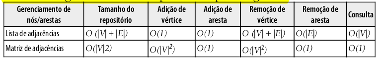

# CAPÍTULO 15 - COMPLEXIDADE DE ALGORITMOS

- Neste capítulo, discutiremos a famosa notação big-O (O grande) e a teoria de NP-completo (NP-completeness); veremos também como podemos nos divertir com alguns algoritmos e aperfeiçoar o nosso conhecimento a fim de melhorar nossas habilidades de programação e de resolução de problemas.

---

## 15.1 - NOÇÃO BIG-0

- Essa notação é usada para descrever o desempenho ou a complexidade de um algoritmo. A notação big-O é usada para classificar algoritmos de acordo com o tempo que eles demorarão para executar, conforme os requisitos de espaço/memória à medida que o tamanho da entrada aumentar;

---

## 15.2 - COMPREENDENDO A NOTAÇÃO BIG-0

- Em geral, usamos recursos como uso (tempo) de CPU, utilização de memória, de disco e de rede. Quando falamos da notação big-O, em geral, consideramos o uso (tempo) de CPU.

---

## 15.3 - 0(1)

- Se tentarmos executar a função increment(1), teremos um tempo de execução igual a x. Se tentarmos executar essa mesma função novamente com um parâmetro diferente (por exemplo, num igual a 2), o tempo de execução também será x. O parâmetro não importa; o desempenho da função de incremento será o mesmo. Por esse motivo, podemos dizer que a função anterior tem complexidade igual a O(1) (é constante);

---

## 15.4 - 0(n)

- Podemos observar que o custo total da execução da função `sequentialSearch` depende do número de elementos do array (tamanho) e do valor que procuramos. Se o item que estivermos procurando estiver presente no array, quantas vezes a linha {1} será executada? Se o item procurado não existir, a linha {1} será executada o número de vezes correspondente ao tamanho do array, que chamaremos de cenário de pior caso. Considerando o cenário de pior caso da função `sequentialSearch`, se tivermos um array de tamanho 10, o custo será igual a 10. Se tivermos um array de tamanho 1.000, o custo será igual a 1.000. Podemos concluir que a função `sequentialSearch` tem uma complexidade de O(n) – em que n é o tamanho do array (entrada).

---

## 15.5 - 0(n2)

- Se executarmos bubbleSort para um array de tamanho 10, cost será igual a 100 (10 2 ). Se executarmos bubbleSort para um array de tamanho 100, cost será 10.000 (100 2 ). Observe que a execução demorará mais tempo ainda sempre que aumentarmos o tamanho da entrada.
- Podemos notar que o código cuja complexidade é O(n) tem apenas um laço for, enquanto, para O(n 2 ) , há dois laços for aninhados. Se o algoritmo tiver três laços for iterando pelo array, provavelmente ele terá uma complexidade de O(n 3 ).

---

## 15.6 - COMPARANDO AS COMPLEXIDADES

- Podemos criar uma tabela com alguns valores para exemplificar o custo do algoritmo, dado o tamanho de sua entrada;
- Podemos desenhar um gráfico baseado nas informações apresentadas na tabela anterior para exibir o custo de diferentes complexidades em notação big-O;

---

## 15.7 - ESTRUTURA DE DADOS

- A tabela a seguir mostra as complexidades das estruturas de dados.

---

## 15.8 - GRAFOS

- A tabela a seguir mostra as complexidades para os grafos.

---

## 15.9 - ALGORITMOS DE ORDENAÇÃO

- A tabela a seguir mostra as complexidades dos algoritmos de ordenação.

---

## 15.10 - ALGORITMOS DE BUSCA

- A tabela a seguir mostra as complexidades dos algoritmos de busca.

;

---

## 15.11 - INTRODUÇÃO Á TEORIA DE NP-COMPLETO

- Em geral, dizemos que um algoritmo é eficiente se tiver complexidade O(n k ) para alguma constante k, e ele é chamado de algoritmo polinomial. Dado um problema em que há um algoritmo polinomial mesmo para o pior caso, o algoritmo é representado por P (polinomial).
- Há outro conjunto de algoritmos chamado NP (Nondeterministic Polynomial, ou Polinomial Não Determinístico). Um problema NP é um problema para o qual a solução pode ser verificada em um tempo polinomial.
- Problemas NP-completos são os mais difíceis de um conjunto NP. Um problema de decisão L será NP-completo se:
  - 1. L está em NP (isto é, qualquer dada solução para problemas NP-completos pode ser verificada rapidamente, mas não há nenhuma
       solução eficiente conhecida).
  - 2. Todo problema em NP pode ser reduzido a L em tempo polinomial.
- Para compreender o que é a redução de um problema, considere L e M como dois problemas de decisão. Suponha que o algoritmo A resolva L. Isso quer dizer que, se y for uma entrada para M, o algoritmo B responderá Sim ou Não conforme y pertencer a M ou não. A ideia é encontrar uma transformação de L para M de modo que o algoritmo B faça parte de um algoritmo A para resolver A.
- Também temos outro conjunto de problemas chamado NP-difícil (NP- hard). Um problema será NP-difícil se tiver a propriedade 2 (de NP-completo) e não precisar ter a propriedade 1. Assim, o conjunto NP-completo também é um subconjunto do conjunto NP-difícil.

---

## 15.12 - PROBLEMAS IMPOSSÍVEIS E ALGORITMOS HEURÍSTICOS

- Alguns dos problemas mencionados são impossíveis de resolver. No entanto, algumas técnicas podem ser usadas para obter uma solução aproximada em um intervalo de tempo satisfatório. Uma técnica seria usar algoritmos heurísticos. Uma solução gerada por métodos heurísticos talvez não seja a melhor das soluções, mas será boa o suficiente para resolver o problema na ocasião;

---

## DIVERTINDO-SE COM ALGORITMOS

- Não estudamos os algoritmos somente porque precisamos entendê-los na faculdade ou porque queremos nos tornar desenvolvedores. Você pode vir a ser um profissional mais bem-sucedido se aperfeiçoar suas habilidades para resolução de problemas usando os algoritmos que vimos neste livro como forma de solucionar problemas. A melhor maneira de aperfeiçoar o seu conhecimento sobre resolução de problemas é praticando, e essa tarefa não precisa ser tediosa.

---

## RESUMO

Neste capítulo, discutimos a notação big-O (O grande) e como podemos calcular a complexidade de um algoritmo aplicando esse conceito. Apresentamos a teoria de NP-completo – um conceito que você poderá explorar melhor se estiver interessado em aprender mais sobre resolução de problemas impossíveis e o uso de métodos heurísticos para obter uma solução aproximadamente satisfatória.

Também apresentamos alguns sites nos quais você poderá se registrar gratuitamente, aplicar todo o conhecimento adquirido com a leitura deste livro e até mesmo receber uma oferta para seu primeiro emprego em TI! Boa programação!
