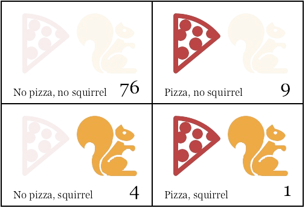

# ESTRUTURA DE DADOS: OBJETOS E ARRAYS

Objetos nos permitem agrupar valores (incluíndo outros objetos) e, consequentemente, construit estruturas mais complexas. Esse capítulo irá adicionar uma compreensão básica sobre estrutura de dados. Ao final, você saberá o suficiente para começar a escrever prgramas úteis. O capítulo iŕa trabalhar com programas mais ou menos realista, introduzindo conceitos a medida em que eles se aplicam ao problema em questão. Os exemplos serão constuido em cima de funções e variáveis que foram apresentadas no início do texto.

---

## O HOMEM-ESQUILO

De vez em quando, geralmente entre oito e dez da noite, Jacques se tranforma em um pequeno roedor peludo com uma cauda espessa. Ele tem que se preocupar em não ser comido pelo gato do vizinho. Por isso resolveu trancar as portas e as janelas do seu quarto durante a noite e colocar algumas nozes no chão para manter-se ocupado.

Isso resolve o problema do gato. Mesmo assim, Jacques ainda sofre com sua condição. As ocorrências irregulares das tranformações o faz suspeitar de que talvez possa ter algua coisa que as ativam.

Mudando para uma abordagem mais cientifica, Jacques pretende começar a manter um registro diário de tudo o que faz e se ele se tranformou. Com essas informações, ele espera ser capaz de diminuit e limitar as condições que ativam as transformações. A primeira coisa ele deverá fazer é criar uma estrutura de dados para armazenar essas informações.

---

## 4.1 - CONJUNTOS DE DADOS

Para trabalhar com um pedaço de dados digitais, primeiramente precisamos encontrar uma maneira de representá-los na memória da nossa máquina. O JavaScript fornece um tipo de dado específico para armazenar uma sequência de valores. Ele é chamado de `array` e é escrito como uma lista de valores separados por vírgulas e entre colchetes.

```js
var listOfNumbers = [2, 3, 5, 7, 11];
console.log(listOfNumbers[1]); // → 3
console.log(listOfNumbers[1 - 1]); // → 2
```

A notação para acessar elementos contidos em um `array` também usa colchetes. Um par de colchetes imediatamente após uma expressão, contendo outra expressão entre colchetes, irá procurar o elemento contido na expressão à esqueda que está na posição dada pelo _índice_ determinado pela expressão entre colchetes.

### INDEXAÇÃO DE ARRAYS

O primeiro índice de uma _array_ é o número zero e não o número um. Portanto, o primeiro elemento pode ser acessado usando `listOfNumbers[0]`. A contagem baseada em zero é uma tradição de longa data no mundo da tecnologia e, desde que seja seguida constantemente, ela funciona bem.

---

## 4.2 - PROPRIEDADES

Praticamente todos os valores no JavaScript possuem propriedades. As únicas exceções são _null_ e _undefined_. Se você tentar acessar a propriedade em algum deles, você receberá um erro.

As duas formas mais comuns de acessar propriedades no JavaScript são usando ponto e colchetes. Ambos acessam uma propriedade em `value`, mas não necessariamente a mesma propriedade. A diferença está em como _x_ é interpretado. Enquanto acessar a propriedade utilzando ponto acessa a propriedade chamada "X", utilizar colchetes tenta avaliar a expressão _x_ e, então, usa o seu resultado como o nome da propriedade. Portanto, se você sabe que a propriedade que você está interessado se chama `length`, você usa `value.length`. Se você deseja extrair a propriedade cujo nome é o valor que está armazenado na variável _i_, você usa _value[i]_. Devido ao fato de que nomes de propriedades podem ser qualquer string, se você quiser acessar as propriedades "2" ou "John Doe", você deve usar os colchetes: _value[2]_ ou _value["John Doe"]_ , pois mesmo sabendo exatamente o nome da propriedade, "2" e "John Doe" não são nomes válidos de variáveis, sendo
impossível acessá-los usando a notação com o ponto.

---

## 4.3 - MÉTODOS

Ambos os objetos `string` e `arrays` possuem além da propriedade length, um número de propriedades que se referem à valores de função.

```js
var doh = 'Doh';
console.log(typeof doh.toUppercase);
console.log(doh.toUppercase());
```

Toda `string`possui uma propriedade `toUpperCase`. Quando chamada, ela retornará uma cópia da string com todas as letras convertidas para maiúsculas. Existe a propriedade `toLowerCase`, que faz o contrário, convertendo para minúsculas. As propriedades quem contêm funções são geralmente chamadas de _métodos_ do valor a que pertencem.

```js
var mack = [];

mark.push('Mack');
mark.push('The', 'Knife');

console.log(mack);
console.log(mack.join(' '));
console.log(mack.pop());
console.log(mack);
```

O método **push** pode ser usado para adicionar valores ao final do array. O método **pop** faz o contrário, remove o valor que está no final do array. Um array de string pode ser combinado em uma única `string` com o método **join**. O argumento passado para o **join** determina o texto que será inserido entre cada elemento do array.

---

## 4.4 - OBJETOS

Voltando ao caso do home-esquilo. Valores do tipo `objeto` são coleções arbitárias de propriedades, sendo que podemos adicionar ou remover essas propriedades da forma que desejamos. Uma maneira de criar um objeto é usando a notação com chaves.

```js
var day1 = {
  squirrel: false,
  events: ['work', 'touch tree', 'pizza', 'running', 'television'],
};

console.log(day1.squirrel); // → false
console.log(day1.wolf); // → undefined
day1.wolf = false;
console.log(day1.wolf); // → false
```

Dentro das chaves, podemos informar uma lista de propriedades separadas por vírgulas. Cada propriedade é escrita com um nome seguido de dois pontos e uma expressão que fornec o valor da propriedade.

```js
var descriptions = {
  work: 'Went to work',
  'touched tree': 'Touched a tree',
};
```

Isso significa que as chaves possuem dois significado. Quando usado no inicio de uma delcaração, elas definem o começo de um bloco de declaração. Em qualquer outro caso, elas descrevem um objeto. Tentar acessar uma propriedade que não existe irá produ um valor `undefined`, o que acontece ao tertar ler a propriedade `wolf` no exemplo anterior.É possível atribuir um valor a uma propriedade usando o operador `=`. Isso irá substituir o valor de uma propriedade, caso ela exista, ou criar uma nova propriedade no objeto se ela não existir.

Operador _delete_ é um operador unário que, quando aplicado a uma propriedade, irá remover tal propriedade do objeto.

```js
var anObject = { left: 1, right: 2 };
console.log(anObject.left); // → 1

delete anObject.left;
console.log(anObject.left); //undefined

console.log('left' in anObject); // → false
console.log('right' in anObject); // → true
```

O operador binário `in`, quando aplicado a uma string ou um objeto, retorna um valor booleano que indica se aquele possui aquela propriedade. A diferença entre alterar uma propriedade para `undefined` e removê-la de fato, é que no primeiro caso, o objeto continua com a propriedade, equanto que no segundo caso, a propriedade não estará mais presente no objeto e o operador `in` retorná `false`. Os arrays são, então apenas um tipo especializado de objeto para armazenar sequência de coisas. Se você executar `typeof[1,2`], irá produzir "object". Portanto, podemos representar o diário de Jacques como um array de objetos:

```js
var journal = [
  {
    events: ['work', 'touched tree', 'pizza', 'running', 'television'],
    squirrel: false,
  },
  {
    events: [
      'work',
      'ice cream',
      'cauliflower',
      'lasagna',
      'touched tree',
      'brushed teeth',
    ],
    squirrel: false,
  },
  {
    events: ['weekend', 'cycling', 'break', 'peanuts', 'beer'],
    squirrel: true,
  },
  /* and so on... */
];
```

---

## 4.5 - MUTABILIDADE

Vimos que os valores de objeto poden ser modificados. Os tipos de valores discutidos nos capítulos anteriores, são imutáveis. É possível mudar o valor já existente desses tipos. Você, a partir deles, combiná-los e criar novos valores, mas quando você analisar um valor específico de string, ele será sempre o mesmo, sendo que o seu texto não pode ser alterado. Por outro lado, no cas de objetos, o conteúdo de um valor pode ser modificado quando alteramos suas propriedades. Quando temos dois números iguais, podemos considerá-los exatamnete os mesmos números, mesmo se eles não fazem referência aos mesmos bits físicos. Entretanto, no caso de objeto há uma diferença entre ter duas referências para o mesmo objeto e ter dois objetos diferentes que possuem as mesmas propriedades.

```js
var object1 = { value: 10 };
var object2 = object1;
var object3 = { value: 10 };

console.log(object1 == object2); // → true
console.log(object1 == object3); // → false

object1.value = 15;

console.log(object2.value); // → 15
console.log(object3.value); // → 10
```

As variáveis `object1` e `object2` estão associadas ao mesmo objeto e, por isso alterar `object1` também altera o valor de `object2`. A variável de `object3` aponta para um objeto diferente, o qual inicialmente contêm as mesmas propriedades de `object1` e sua existência é totalmente separada. Quando comparamos objetos, o operador `==` irá retornar true apenas se ambos os objetos possuem exatamente o mesmo valor. Comparar objetos diferentes irá retornar `false` mesmo se eles tiverem conteúdos idênticos.

---

## 4.6 - O LOG DA LICANTROPIA

Jacques inicia seu interpretador de JavaScript e configura o ambiente que ele precisa para manter o eu diário.

```js
var journal = [];

function addEntry(events, didITurnIntoASquirrel) {
  journal.push({
    events: events,
    squirrel: didITurnIntoASquirrel,
  });
}
```

E então, todas as noites às dez ou as vezes na manhã seguite, ele faz o registro do dia.

```js
addEntry(['work', 'touched tree', 'pizza', 'running', 'television'], false);
addEntry(
  [
    'work',
    'ice cream',
    'cauliflower',
    'lasagna',
    'touched tree',
    'brushed teeth',
  ],
  false
);
addEntry(['weekend', 'cycling', 'break', 'peanuts', 'beer'], true);
```

Uma vez que ele tem dados suficiente, ele pretente calcular a correlação entre sua transformação em esquilo e cada um dos eventos do dia e espera aprender algo útil a partir dessa correlações.

A `correlação` é uma medida de dependência entre variáveis. Ela é geralmente expressa em um coeficiente que vaira de -1 a 1. Zero correlações significa que as variáveis não são relacionadas, enquanto que a correlação de um indica que as variáveis são perfeitamente relacionadas. A correlação negativa de um também indica que as variáveis são perfeitamente relacionadas, mas são opostas.

Para variáveis booleanas, o coeficiente phi (ϕ) fornece uma boa forma de medir a correlação e é relativamente fácil de ser calculado. Para calcular ϕ, precisamos de uma tabela n que contê o número de vezes que as diversas combinações das duas variáveis foram observadas. ϕ pode ser calculado usando a seguinte fórmula, onde n se refere à tabela.

;

```txt
ϕ = (n11n00 - n10n01) / √ n1•n0•n•1n•0
[TODO: Adicionar formatação correta da fórmula após converter em asciidoc]
```

A notação n01 indica o número de ocorrências nas quais a primeira variável (transformar-se em esquilo) é falsa (0) e a segunda variável (pizza) é verdadeira (1). Nesse exemplo, n01 é igual a 9. O valor n1• se refere à soma de todas as medidas nas quais a primeira variável é verdadeira, que no caso do exemplo da tabela é 5. Da mesma forma, n•0 se refere à soma de todas as medidas nas quais a segunda variável é falsa. Portanto, para a tabela de pizza, a parte de cima da linha (o dividendo) seria 1x76 - 4x9 = 40, e a parte de baixo (o divisor) seria a raiz quadrada de 5x85x10x80, ou √340000. Esse cálculo resulta em ϕ ≈ 0.069, o que é um valor bem pequeno. Comer pizza parece não ter influência nas transformações.

---

## 4.7 - CALCULANDO A CORRELAÇÃO

A maneira mais simples e que faz com que seja mais fácil acessar os dados é utilizando um array com quatro elementos. Nós iremos interpretar os índices do array como elementos binários de dois bits, onde o dígito a esquerda se refere à variável do esquilo, e o dígito a direita se refere à variável do evento. Por exemplo, o número binário 10 se refere ao caso no qual Jacques se tornou um esquilo, mas o evento não ocorreu. Isso aconteceu quatro vezes, e já que o número binário 10 é equivalente ao número 2 na notação decimal, podemos armazenar esse valor no índice 2 do array.

```js
function phi(table) {
  return (
    (table[3] * table[0] - table[2] * table[1]) /
    Math.sqrt(
      (table[2] + table[3]) *
        (table[0] + table[1]) *
        (table[1] + table[3]) *
        (table[0] + table[2])
    )
  );
}
console.log(phi([76, 9, 4, 1]));
// → 0.068599434
```

`Math.sqrt` é uma função que calcula a raiz quadrada, fornecida pelo objet `Math` que é padrão do JavaScript. Temos que somar dois campos da tabela para encontrar como n1\*, pois a soma das linhas ou colunas não são armazenadas diretamente em nossa estrutura de dados. Jacques manteve seu díario por três meses. O conjunto de dados resultante está disponivel no arquivo [JOURNAL](./exemplos/ex4_7/journal.js),presente na pasta de exemplos. Para extrair uma tabela dois por dois de um evento específico desse diário, devemos usar um loop para percorrer todas as entradas e ir adicionando quantas vezes o evento ocorreu em relação às transformações de esquilo.

```js
function hasEvent(event, entry) {
  return entry.events.indexOf(event) != -1;
}

function tableFor(event, journal) {
  var table = [0, 0, 0, 0];
  for (var i = 0; i < journal.length; i++) {
    var entry = journal[i],
      index = 0;
    if (hasEvent(event, entry)) index += 1;
    if (entry.squirrel) index += 2;
    table[index] += 1;
  }
  return table;
}
console.log(tableFor('pizza', JOURNAL));
// → [76, 9, 4, 1]
```

A função `hasEvent` testa se uma entrada contém ou não o evento em questão. Os arrays possuem um método `indexOf` que procura pelo valor informado no array (nesse exemplo o nome do evento), e retorna o índice onde ele foi encontrado ou -1 se não for. O corpo do loop presente na função tableFor , descobre qual caixa da tabela cada entrada do diário pertence, verificando se essa entrada contém o evento específico e se o evento ocorreu juntamente com um incidente de transformação em esquilo. O loop adiciona uma unidade no número contido no array que corresponde a essa caixa na tabela. Agora temos as ferramentas necessárias para calcular correlações individuais. O único passo que falta é encontrar a correlação para cada tipo de evento que foi armazenado e verificar se algo se sobressai.

---

## 4.8 - OBJETOS COMO MAPAS

Podemos usar as propriedades do objeto nomeadas de acordo com o tipo do evento. Podemos usar a notação de colchetes para acessar e ler as propriedades e, além disso, usar o operador `in` para testar se tal propriedade existe.

```js
var map = {};
function storePhi(event, phi) {
  map[event] = phi;
}
storePhi('pizza', 0.069);
storePhi('touched tree', -0.081);
console.log('pizza' in map);
// → true
console.log(map['touched tree']);
// → -0.081
```

Um map é uma maneira de associar valores de um domínio com valores correspondentes em outro domínio. Diferentemente de um array, as propriedades não formam uma sequência previsível, impossibilitando o uso de um loop `for` normal. Entretanto, o JavaScript fornece uma contrução de loop específica para percorrer as propriedades de um objeto.

```js
for (var event in map)
  console.log("The correlation for '" + event + "' is " + map[event]);
// → The correlation for 'pizza' is 0.069
// → The correlation for 'touched tree' is -0.081
```

---

## 4.9 - A ANÁLISE FINAL

Para achar todos os tipos de eventos que estão presentes no conjunto de dados, nós simplismente processamos cada entrada e percorremos por todos os eventos presentes usando um loop. A partir do momento em que encontramos um tipo que não está presente no objeto, calculamos o valor de sua correlação e então adicionamos ao objeto.

```js
function gatherCorrelations(journal) {
  var phis = {};
  for (var entry = 0; entry < journal.length; entry++) {
    var events = journal[entry].events;
    for (var i = 0; i < events.length; i++) {
      var event = events[i];
      if (!(event in phis)) phis[event] = phi(tableFor(event, journal));
    }
  }
  return phis;
}

var correlations = gatherCorrelations(JOURNAL);
console.log(correlations.pizza);
// → 0.068599434
```

E o resultado é:

```js
for (var event in correlations) console.log(event + ': ' + correlations[event]);
// → carrot:
0.0140970969;
// → exercise: 0.0685994341
// → weekend:0.1371988681
// → bread:-0.0757554019
// → pudding: -0.0648203724
// and so on...
```

A grande maioria das correlações tende a zero. Entretanto, elas parecem acontecer com mais frequência aos finais de semana. Vamos filtrar os resultados para mostrar apenas as correlações que são maiores do que 0.1 ou menores do que -0.1.

```js
for (var event in correlations) {
  var correlation = correlations[event];
  if (correlation > 0.1 || correlation < -0.1)
    console.log(event + ': ' + correlation);
}
// → weekend:
0.1371988681;
// → brushed teeth: -0.3805211953
// → candy:0.1296407447
// → work:-0.1371988681
// → spaghetti:0.2425356250
// → reading:0.1106828054
// → peanuts:0.5902679812
```

Existem dois fatores nos quais a correlação é claramente mais forte que a das outras. E testando uma outra coisa podemos concluir que:

```js
for (var i = 0; i < JOURNAL.length; i++) {
  var entry = JOURNAL[i];
  if (hasEvent('peanuts', entry) && !hasEvent('brushed teeth', entry))
    entry.events.push('peanut teeth');
}
console.log(phi(tableFor('peanut teeth', JOURNAL)));
// → 1
```

Está bem evidente! O fenômeno ocorre precisamente quando Jacques come amendoins e não escova os dentes. Se ele não fosse preguiçoso em relação à higiene bucal, ele não sequer teria reparado nesse problema que o aflige. Sabendo disso, Jacques simplesmente para de comer amendoins e descobre que isso coloca um fim em suas transformações. Tudo ficou bem com Jacques por um tempo.

---

## 4.10 - ESTUDO APROFUNDADO DE ARRAYS

Os métodos correpondentes para adicionar e remover itens no inicio de um array são chamados `unshift` e `shift`.

```js
var todolist = [];
function rememberTo(task) {
  todoList.push(task);
}

function whatIsNext() {
  return todoList.shift();
}

function urgerntlyRememberTo(task) {
  todoList.unshift(task);
}
```

O programa anterior gerencia uma lista de tarefa. Você pode adicionar tarefas no final da lista chamando `remeberTo('eat')` e, quando estiver preparado para realizar alguma tarefa, você chama `whatIsNext()` para acessar e remover o primeiro item da lista. A função `ungetlyRememberTo` também adiciona uma tarefa, porém, ao invés de adicionar ao final da lista, adiciona no início.

O método `indexOf` tem um irmão chamado `lastIndexOf`, que começa a pesquisar um dado começando pelo final do array.

```js
console.log([1, 2, 3, 2, 1].indexOf(2));
// → 1
console.log([1, 2, 3, 2, 1].lastIndexOf(2));
// → 3
```

Ambos recebem um segundo argumento opcional que indica onde iniciar a pesquisa. Outro método fundamental é o `slice` que recebe um índice de início e outro de parada, retornando um array que contém apenas os elementos presentes entres índices.

```js
console.log([0, 1, 2, 3, 4].slice(2, 4));
// → [2, 3]
console.log([0, 1, 2, 3, 4].slice(2));
// → [2, 3, 4]
```

Quando o índice de parada não é informado, o `slice` irá pegar todos os elementos após o índice de início. Strings também possuem o método `slice` com um comportamento similar. O método `concat` pode ser utilziado para unir arrays. Ele recebe um array e um índice como argumento, retorna um novo array que é uma cópia do array original, exceto pelo fato de que o elemento no índice informado foi removido.

```js
function remove(array, index) {
  return array.slice(0, index).concat(array.slice(index + 1));
}
console.log(remove(['a', 'b', 'c', 'd', 'e'], 2));
// → ["a", "b", "d", "e"]
```

---

## 4.11 - STRINGS E SUAS PROPRIEDADES

Podemos ler propriedades como `length` e `toUpperCase` de strings. Porém, caso tente adicionar uma nova propriedade, ela não será adicionada.

```js
var myString = 'Fido';
myString.myProperty = 'value';
console.log(myString.myProperty);
```

Valores do tipo string, number e Boolean não são objetos, esses valores são imutáveis e não podem ser alterados. Mesmo assim, esse tipo possuem propriedades nativas. Toda string possui uma série de métodos. Provavelmente, alguns dos mais úteis são `slice` e `indexOf`.

```js
console.log('coconuts'.slice(4, 7)); // → nut
console.log('coconut'.indexOf('u')); // → 5
```

Uma diferença é que o `indexOf` das strings pode receber uma string contendo mais de um caractere, enquanto que o método correspondente no array procura apenas por um único elemento.

```js
console.log('one two three'.indexOf('ee')); // → 11
```

O método `trim` remove todos os espaços vazios do começo e do final de uma string.

```js
console.log(' okay \n '.trim()); // → okay
```

Para acessar caracteres indivíduais de uma string, podemos usar o método `charAt` ou simplismente ler suas propriedade numéricas, da mesma forma que você faria em um array.

```js
var string = 'abc';

console.log(string.length); // → 3
console.log(string.charAt(0)); // → a
console.log(string[1]); // → b
```

---

## 4.12 - O OBJETO ARGUMENTS

Sempre que uma função é invocada, uma variável especial chamada `arguments` é adicionada ao ambiente no qual o corpo da função executa. Essa variável se refere a um objeto que contém todos os argumentos passados à função.

```js
function noArguments() {}
noArguments(1, 2, 3); // → This is okay
function threeArguments(a, b, c) {}
threeArguments();
```

O objeto `arguments` possui a propriedade `length` que nos informa o número de argumentos que realmente foi passado à função. Esse objetivo é muito parecido com um array. Porém, ele não possui nenhum dos métodos de array, fazendo com que seja um pouco mais difícil de se usar do que um array de verdade.

```js
function argumentCounter() {
  console.log('You gave me', arguments.length, 'arguments.');
}
argumentCounter('Straw man', 'Tautology', 'Ad hominem');
// → You gave me 3 arguments.
```

Agumas funções podem receber qualquer número de argumentos, como no caso de `console.log`. Essa função normalmente percorre por todos os valores em seu objeto `arguments` e pode ser usada para criar interfaces extremamente agradáveis.

```js
addEntry(['work', 'touched tree', 'pizza', 'running', 'television'], false);
```

Devido ao fato de que essa função irá ser executada muitas vezes, poderíamos criar uma alternativa mais simples.

```js
function addEntry(squirrel) {
  var entry = { events: [], squirrel: squirrel };
  for (var i = 1; i < arguments.length; i++) entry.events.push(arguments[i]);
  journal.push(entry);
}
addEntry(true, 'work', 'touched tree', 'pizza', 'running', 'television');
```

Essa versão lê o primeiro argumento da forma normal e depois percorre o resto dos argumentos juntando-os em um array.

---

## 4.13 - O OBJETO MATH

O objeto `Math` é usado como um _container_ para agrupar uma série de funcionalidades relacionadas. Existe apenas um único objeto `Math` e, na maioria das vezes , ele é útil quando usado como um valor. Mas precisamente, ele fornece um _namespace_ para que todas essas funções e valores não precisem ser declaradas como variáveis globais. Caso precise realizar cálculos trigonométricos, `Math` pode ajudá-lo. Ele contém `cos` (cosseno), `sin`(seno) e `tan`(tangente), tanto quanto suas funções inversas `aos`, `asin` e `atan` respectivamente. O número pi, é representada através de um número no JavaScript, está disponível como `Math.PI`.

```js
function randomPointOnCircle(radius) {
  var angle = Math.random() * 2 * Math.PI;
  return { x: radius * Math.cos(angle), y: radius * Math.sin(angle) };
}
console.log(randomPointOnCircle(2));
// → {x: 0.3667, y: 1.966}
```

O exemplo anterior utiliza o `Math.random`. Essa função retorna um número "pseudo-aleatório" entre zero (incluído) e um (excluído) toda vez que você chama.

```js
console.log(Math.random());
// → 0.36993729369714856
console.log(Math.random());
// → 0.727367032552138
console.log(Math.random());
// → 0.40180766698904335
```

Embora os computadores sejam deterministas, é possivel fazer com que els produzam números que pareçam ser aleatórios. Para fazer issso, a máquina mantém um número armazenado em seu estado interno. Assim, toda vez que um número aleatório é requisitado, ele executa alguns cálculos complicados e deterministas usando esse estado interno e, então, retorna parte do resultado desses cálculos. A máquina também utiliza esses resultados para mudar o seu estado interno, fazendo com que o próximo número "aleatório" produzido seja diferente. E se quisermos um número aleatório inteiro? Podemos utilizar `Math.floor`.

```js
console.log(Math.floor(Math.random() * 10)); // → 2
```

Multiplicar o número aleatório por dez resulta em um número que seja maior ou igual a zero e menor do que dez. Devido ao fato de que Math.floor arredonda o valor para baixo, essa expressão irá produzir, com chances iguais, qualquer número de zero a nove. Também existem as funções Math.ceil (para arredondar o valor para o maior número inteiro mais próximo) e
`Math.round` (para arredondar o valor para o número inteiro mais próximo).

---

## 4.14 - OBJETO GLOBAL

O escopo global, que é o espaço no qual as variáveis globais residem, também pode ser abordado como um objeto no JavaScript. Cada variável global está presente como uma propriedade desse objeto. Nos navegadores, o objeto do escopo global é armazenado na variável _window_.

```js
var myVar = 10;
console.log('myVar' in window); // → true
console.log(window.myVar); // → 10
```

---

## RESUMO

Objetos e arrays (que são tipos específicos de objetos) fornecem maneiras de agrupar uma conjunto de valores em um único valor. Conceitualmente, ao invés de tentar carregar e manter todas as coisas individualmente em nossos braços, eles nos permitem colocar e carregar todas as coisas relacionadas dentro de uma bolsa.

Com exceção de _null_ e _undefined_ , a maioria dos valores no JavaScript possuem propriedades e são acessados usando `value.propName` ou `value["propName"]`. Objetos tendem a usar nomes para suas propriedades e armazenam mais o menos uma quantidade fixa delas. Por outro lado, os Arrays normalmente contêm quantidades variáveis de valores conceitualmente iguais e usam números (iniciando do zero) como os nomes de suas propriedades.

Existem algumas propriedades com nomes específicos nos arrays, como `length` e uma série de
métodos. Métodos são funções que são armazenadas em propriedades e, normalmente, atuam no valor nas quais elas são propriedade.

Objetos podem também ser usados como mapas, associando valores com seus nomes. O operador `in` pode ser usado para verificar se um objeto contém a propriedade com o nome informado. A mesma palavra-chave pode ser usada em um loop `for ( for (var name in object) )` para percorrer todas as propriedades do objeto.
