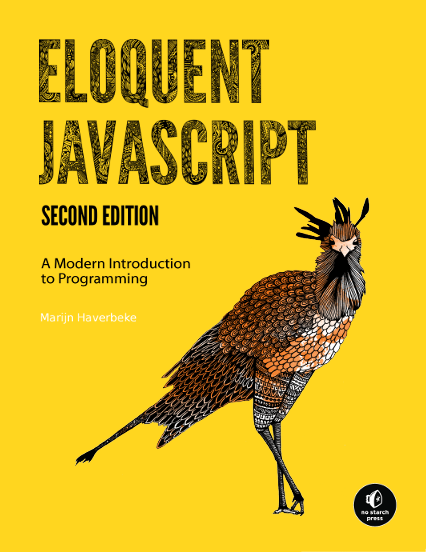

# JavaScript Eloquente - 2ª edição

**Uma moderna introdução ao JavaScript, programação e maravilhas digitais.**

---

## Introdução

---

## Conteúdo do Livro

|        Capitulos        | Descrição                                          |
| :---------------------: | :------------------------------------------------- |
| [Capítulo 01](./cap01/) | Valores, Tipos e Operadores                        |
| [Capítulo 02](./cap02/) | Estrutura do Programa                              |
| [Capítulo 03](./cap03/) | Funções                                            |
| [Capítulo 04](./cap04/) | Estrutura de Dados: Objetos e Array                |
| [Capítulo 05](./cap05/) | Funções de Ordem Superior                          |
| [Capítulo 06](./cap06/) | A Vida Secretad dos Objetos                        |
| [Capítulo 07](./cap07/) | `Prática` - Vida Eletrônica                        |
| [Capítulo 08](./cap08/) | Erros e Manipulações de Erros                      |
| [Capítulo 09](./cap09/) | Expressões Regulares                               |
| [Capítulo 10](./cap10/) | Módulos                                            |
| [Capítulo 11](./cap11/) | `Prática`: A linguagem de Programação              |
| [Capítulo 12](./cap12/) | JavaScript e o Navegador                           |
| [Capítulo 13](./cap13/) | Documente Object Model                             |
| [Capítulo 14](./cap14/) | Manipulando Eventos                                |
|     [Capítulo 15]()     | `Projeto`: PLataforma de Jogo                      |
|     [Capítulo 16]()     | Desenhando no Canvas                               |
|     [Capítulo 17]()     | HTTP                                               |
|     [Capítulo 18]()     | Formulários e Campos Formulários                   |
|     [Capítulo 19]()     | `Projeto`: Um Programa de Pintura                  |
|     [Capítulo 20]()     | Node.js                                            |
|     [Capítulo 21]()     | `Projeto`: Website de Comportamento de Habilidades |
|     [Capítulo 22]()     |                                                    |
