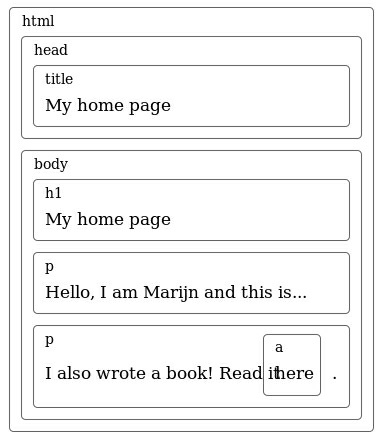
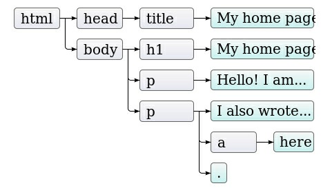
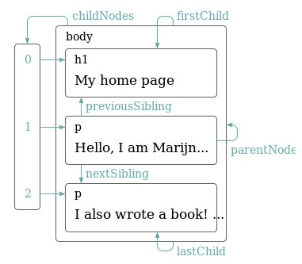

# O MODELO DE OBJETO DE DOCUMENTO (DOM)

O navegoder contrói um modelo da estrutura do documento e depois usa esse modelo para desenhar a página na tela. UM dos "brinquedos" que um programa em JavaScript possui disponível em sua caixa de ferramentas é essa representação do documento. Você pode lê-la e também alterá-la. Essa representação age como uma estrutura viva de dados: quando modificada, a página na tela é atualizada para refletir as mudanças.

---

## 13.1 - ESTRUTURA DO DOCUMENTO

Um documento HTML pode ser imaginado como um conjunto de caixas aninhadas.Tags que encapsulam outras tags, as quais, por sua vez, contêm outras tags ou texto.

```html
<html>
  <head>
    <title>Minha home page</title>
  </head>
  <body>
    <h1>Minha home page</h1>
    <p>Olá, eu sou Marijn e essa é minha home page.</p>
    <p>
      Eu também escrevi um livro! leia-o
      <a href="http://eloquentjavascript.net">aqui</a>.
    </p>
  </body>
</html>
```

Essa página tem a seguinte estrutura

;

Para cada caixa há um objeto, com o qual podemos interagir para descobrir coisas como: qual tag HTML ele representa e quais caixas e textos ele contém. Essa representação é chamada de `Modelo de Objeto de Documentos`, também apelidada de `DOM`. A variável global _document_ nos dá acesso à esses objetos. Sua propriedade _documentElement_ se refere ao objeto que representa a tag. Essa propriedade também nos fornece as propriedades _head_ e _body_, alocando objetos para esses elementos.

---

## 13.2 - ÁRVORES

Nós chamamos uma estrutura de dados de uma árvore quando ela possui uma estrutura de galhos, sem ciclos e possui uma única, bem definida, raiz. No caso do DOM, documente.documentElement representa a raiz. Uma árvore típica possui diferentes tipos de nós. Nós de aplicação sempre têm filhos, diferentemente das variáveis e valores, que eram folhas, ou sej, nós sem filhos. O mesmo vale para o DOM. Nós de elementos comuns, os quais representam tags HTML. determinam a estrutura do documente. Esses pode possui nós filhos. Cada objeto que é um nó do DOM tem a proriedade nodeType, a qual contém um código numérico que identifica o tipo de nó. Elementos comuns têm valor 1, o qual também é definido como a propriedade constante \_document.ELEMENT_NODE. Nós de texto, representam um intervalo de texto no documento, possuem o valo 3. Comentário têm valor 8. Sendo assim, outra maneira de visualizar a árvore do nosso documento é:



Na imagem acima, as folhas são os nós de texto e as setas indicam a relação de pai e filho entre os nós.

---

## 13.3 - O PADRÃO

Padrões são, geralmente, úteis, mas nesse caso, a vantagem (consistência entre diferentes linguagens), não é tão convincente. Possuir uma interface que é corretamente integrada com a linguagem que você está usando vai fazer você economizar mais tempo do que uma interface familiar entre diferentes linguagens. Existem outros problemas que são simplesmente ocasionados por um design falho. Por exemplo: não há nenhuma maneira de criar um novo nó e imediatamente adicionar nós filhos ou atributos à ele. Ao invés disso, você precisa primeiro criá-lo, depois adicionar os filhos, um por um, e só então definir os atributos um à um usando side effects. Códigos que interagem muito com o DOM tendem à ficar muito longos, repetitivos e feios. Porém nenhuma dessas falhas é fatal, pois JavaScript nos permite criar nossas próprias abstrações. É fácil escrever algumas funções auxiliares que permitem que você expresse as operações que quer fazer de maneira
mais curta. Na verdade, muitas lib raries dedicadas à programação em browsers já vêm com essas ferramentas.

---

## 13.4 - MOVENDO-SE ATRAVÉS DE ÁRVORES

Os nós DOM contêm uma variedade de ligações para outro nós próximos.



Todo nó possui uma proprieade _parentNode_ que aponta para o nó que o contém. Dassa maneira, todo nó de um elemento possui a propriedade _childNode_ que aponta para um objeto parecido com um array, o qual contém seus nós filhos. As propriedades _firstChild_ e _lastChild_ apontam para o primeiro e último elemento filho, respectivamente, ou entõ possuem o valor null para nós sem filhos. Similarmente, _previousSibling_ e _nextSibling_ apontam para os nós adjacentes, que são nós com o mesmo pai que aparecem imediatamente antes ou depois do nó em questão. No caso de usarmos a propriedade _proviousSibling_ para um primeiro nó filho, ela irá possuir um valor nulo, o mesmo acontece se usarmos a propriedade nextSibling para o último nó filho. Quando lidamos com uma estrutura de dados aninhada como essa, funções recursivas são geralmente muito úteis. A função abaixo escaneia um documento procurando por nós de texto contendo uma determinada string e retorna _true_ quando encontrar um.

```js
function talkAbout(node, string) {
  if (node.nodeType == document.ELEMENT_NODE) {
    for (var i = 0; i < node.childNodes.length; i++) {
      if (talksAbout(node.childNodes[i], string)) return true;
    }
    return false;
  } else if (node.nodeTYpe == document.TEXT_NODE) {
    return node.nodeValue.indexOf(string) > -1;
  }
}

console.log(talkAbout(document.body, 'book')); // → true
```

A propriedade _nodeValue_ de um nó de texto se refere à string de texto que ele representa.

---

## 13.5 - ENCONTRANDO ELEMENTOS

Se quisermos obter atributo _hrf_ do link, seria muito melhor se pudéssemos dizer "pegue o primeiro link nesse documento". E nós podemos:

```js
var link = document.body.getElementsByTagName('a')[0];
console.log(link.href);
```

Todos os nós possuem um método, o qual coleta todos os elementos com o nome passado _getElementsByTagName_
que são descendentes (filhos diretos ou indiretos) do nó dado e retorna-os no formato de um objeto parecido com
um array. Para encontrar um nó único específico, você pode dar à ele um atributo _document.getElementById_
id e usar o método.

```html
<p>Minha avestruz Gertrude:</p>
<p></p>

<script>
  var ostrich = document.getElementById('gertrudes');
  console.log(ostrich.src);
</script>
```

Um terceiro método, similar a esse, é o _getElementsByClassName_, o qual, assim como _getElementsByTagName_, faz uma
busca entre os conteúdos de um nó elemento e retorna todos os elementos que possuem a string passada no seu atributo class.

---

## 13.6 - ALTERANDO O DOCUMENTO

Quase tudo na estrutura de dados DOM pode ser alterado. O método _removeChild_ remove um dado nó filho do documento. Para adicionar um filho, nós podemos usar o método _appendChild_, o qual coloca nó filho no fim da lista de filhos, ou até o método _insertBefore_, que insere um nó passado como primeiro argumento antes do nó passado como segundo argumento.

```html
<p>Um</p>
<p>Dois</p>
<p>Três</p>

<script>
  var paragraphs = document.body.getElementsByTagName('p');
  document.body.insertBefore(paragraphs[2], paragraphs[0]);
</script>
```

Todas as operações que inserem um nó em algum lugar irão, como efeito colateral, fazer com que ele seja removido de sua posição atual (caso ele tenha uma). O método _replaceChild_ é usado para substituir um nó filho por outro. Ele aceita como argumentos dois nós: um novo nó e o nó à ser substituído. O nó substituído deverá ser um filho do elemento com o qual o método é chamado. Note que ambos _replaceChild_ e _insertBefore_ esperam o seu novo nó como primeiro argumento.

---

## 13.7 - CRIANDO NÓS

NO exemplo seguinte, queremo escrever um script que substitua todas as imagens (tags img) no documento pelo texto que elas possuem no seu atributo alt, o qual especifica uma alternativa textual para representação da imagem. Isso envolve não só remover as imagens, mas adicionar um novo nó de texto para substituí-las. Para isso, será usado o método _document.createTextNode_.

```html
<p>
  The  in the
  .
</p>
<p><button onclick="replaceImages()">Substituir</button></p>

<script>
  function replaceImages() {
    var images = document.body.getElementsByTagName('img');
    for (var i = images.length - 1; i >= 0; i--) {
      var image = images[i];
      if (image.alt) {
        var text = document.createTextNode(image.alt);
        image.parentNode.replaceChild(text, image);
      }
    }
  }
</script>
```

Se preferir um conjunto sólido de nós, em oposição a um conjunto em tempo real, você pode converte o conjunto para um array de verdade, chamando o método _slice_.

```js
var arrayish = { 0: 'um', 1: 'dois', length: 2 };
var real = Array.prototype.slice.call(arrayish, 0);
real.forEach(function (elt) {
  console.log(elt);
}); // → um // dois;
```

Para criar nós comuns de elementos (tipo 1), você pode usar o método _document.createElement_. Esse método pega o nome de uma tag e retorna um novo nó vazio do tipo fornecido. O exemplo à seguir define uma função _elt_, a qual cria um nó de elemeto e trata dos algumentos como filhos para aquele nó. Essa função é depois usada para adicionar uma simples atribuição para uma citação.

```html
<blockquote id="quote">
  Nenhum livro pode ser terminado. Enquanto trabalhos nele nós aprendemos apenas
  o suficiente para considerá-lo imaturo no momento em que damos as costas a
  ele.
</blockquote>
<script>
  function elt(type) {
    var node = document.createElement(type);
    for (var i = 1; i < arguments.length; i++) {
      var child = arguments[i];
      if (typeof child == 'string') child = document.createTextNode(child);
      node.appendChild(child);
    }
    return node;
  }
  document
    .getElementById('quote')
    .appendChild(
      elt(
        'footer',
        '—',
        elt('strong', 'Karl Popper'),
        ', prefácio da segunda edição de ',
        elt('em', 'A Sociedade Aberta e Seus Inimigos'),
        ', 1950'
      )
    );
</script>
```

---

## 13.8 - ATRIBUTOS

Alguns atributos de elementos, como `href` para links, pode ser acessados através de uma proprieadade com o mesmo nome do objeto DOM do elemento. Esse é o caso para um conjunto limitado de atributos padrões comumente usados. HTML permite que você defina qualquer atributo que você queira em nós. Isso pode ser útil, pois pode permitir que você guarde informações extras em um documento. Se você quiser fazer seus próprios nomes de atributos, porém, esses atributos não estarão presentes como uma propriedade no nó do elemento. Ao invés disso, você terá que usar os métodos _getAttribute_ e _setAttribute_ para trabalhar com eles.

```html
<p data-classified="secret">O código de lançamento é 00000000.</p>
<p data-classified="unclassified">Eu tenho dois pés.</p>
<script>
  var paras = document.body.getElementsByTagName('p');
  Array.prototype.forEach.call(paras, function (para) {
    if (para.getAttribute('data-classified') == 'secret')
      para.parentNode.removeChild(para);
  });
</script>
```

Eu recomendo prefixar os nomes dos atributos inventados com data-, para certificar-se que eles não irão entrar em conflito com outros atributos. Como um simples exemplo, nós iremos escrever um "destacador de sintaxe" que procura por tags `<pre>` com um atributo _data-linguage_ e tenta destacar as palavras chaves para aquela linguagem.

```js
function highlightCode(node, keywords) {
  var text = node.textContent;
  node.textContent = ''; // Limpa o nó.
  var match,
    pos = 0;
  while ((match = keywords.exec(text))) {
    var before = text.slice(pos, match.index);
    node.appendChild(document.createTextNode(before));
    var strong = document.createElement('strong');
    strong.appendChild(document.createTextNode(match[0]));
    node.appendChild(strong);
    pos = keywords.lastIndex;
  }
  var after = text.slice(pos);
  node.appendChild(document.createTextNode(after));
}
```

Nós podemos sublinhar automaticamente todos os códigos de programas na página fazendo um looping entre todos os elementos `<pre>` que possuem o atributo _data-language_ e então chamando a função highlightCode em cada um e depois aplicando uma expressão regular adequada para a linguagem que se quer destacar.

```js
var languages = {
  javascript: /\b(function|return|var)\b/g /* … etc */,
};
function highlightAllCode() {
  var pres = document.body.getElementsByTagName('pre');
  for (var i = 0; i < pres.length; i++) {
    var pre = pres[i];
    var lang = pre.getAttribute('data-language');
    if (languages.hasOwnProperty(lang)) highlightCode(pre, languages[lang]);
  }
}
```

Por exemplo:

```html
<p>Aqui está, a função identidade:</p>
<pre data-language="javascript">
function id(x) { return x; }
</pre>
<script>
  highlightAllCode();
</script>
```

Existe um atributo comumente usado, _class_, o qual é uma palavra reservada na linguagem JavaScript. Por razões
históricas a propriedade usada para acessar esse atributo é chamada de _className_. VocEê também pode acessá-la pelo seu nome real, "class", usando os métodos _getAttribute_ e _setAttribute_.

---

## 13.9 - LAYOUT

Você provavelmente notou que tipos diferentes de elementos são dispostos de maneira diferente. Alguns, como parágrafos ou cabeçalhos, ocupa toda a alargura do documento e são mostrados em linhas separadas. Esses são chamados de elementos de bloco. Outros, como links ou elemento `<strong>`, são mostrados na mesma linha, juntament com o texto que o cerca. Esses elemento são chamados elementos _inline_. O tamanho e posição de um elemento pode ser acessado através de JavaScript. As propriedades _offseWidth_ e _offsetHeigth_ irão fornecer à você o espaço que o elemento ocupa em pixel.
Eles forncece o espaço dentro do elemento, ignorando a largura da borda.

```html
<p style="border: 3px solid red">Estou encaixotado em</p>

<script>
  var para = document.body.getElementsByTagName('p')[0];
  console.log('clientHeight:', para.clientHeight);
  console.log('offsetHeight:', para.offsetHeight);
</script>
```

A maneira mais efetiva de encontrar a posição precisa de um elemento na tela é o método _getBoundingClientReact_. Ele retorna um objeto com as propriedades top, bottom, left e right, que correspondem às posições dos pixels em relaç~ao ao canto esquerdo da tela. Se você quiser que eles sejam relativos ao documento como um todo, você deverá adicionar a posição de rolagem, encontrada à partir das variáveis globais _pageXOffset_ e _pageYOffset_. Um programad que repetidamente altera entre ler infomrações sobre a organização do DOM e alterá-lo, força muitas reoganizações e consequentemente compromete o desempenho. O código à seguir mostra um exemplo disso. Ele contém dois programads diferentes que constroem uma linha "X" caracteres com 2000 pixels de comprimento e mede quatro tempo cada um leva.

```html
<p><span id="one"></span></p>
<p><span id="two"></span></p>

<script>
  function time(name, action) {
    var start = Date.now(); // Tempo atual milissegundos
    action();
    console.log(name, 'took', Date.now() - start, 'ms');
  }
  time('naive', function () {
    var target = document.getElementById('one');
    while (target.offsetWidth < 2000)
      target.appendChild(document.createTextNode('X'));
  });
  // → naive levou 32 ms
  time('clever', function () {
    var target = document.getElementById('two');
    target.appendChild(document.createTextNode('XXXXX'));
    var total = Math.ceil(2000 / (target.offsetWidth / 5));
    for (var i = 5; i < total; i++)
      target.appendChild(document.createTextNode('X'));
  });
  // → clever levou 1 ms
</script>
```

---

## 13.10 - ESTILIZANDO

A meneira que uma tag `img` mostra uma imagem, e a maneira que uma tag `a` faz com que o link seja acessado quando é clicado, estão ligadas ao tipo de elemento. Assim como a cor de texto ou sublinhado, pode ser mudado por nós.

```html
<p><a href=".">Normal link</a></p>
<p><a href="." style="color: green">Link verde</a></p>
```

Um atributo style pode conter um ou mais declarações, as quais são propriedades. Caso existam múltiplas declarações, elas deverão ser separadas por pontos e vírgulas. Existem muitos aspectos que podem ser influenciados através dessa estilização. Por exemplo, a propriedade _display_ controla quando um elemento é mostrado como um bloco ou em linha.

```html
Esse texto é mostrado <strong>em linha</strong>,
<strong style="display: block">como um bloco</strong>, e
<strong style="display: none">não é mostrado</strong>.
```

Código JavaScript pode manipular diretamente o estilo de um elemento através da propriedade style do nó. Essa propriedade carrega um objeto que possui todas as propriedades possíveis para o atributo style. Os valores dessas propriedades são strings, os quais nós podemos escrever para mudar um aspecto em particular do estilo do elemento.

```html
<p id="para" style="color: purple">Texto bonito</p>
<script>
  var para = document.getElementById('para');
  console.log(para.style.color);
  para.style.color = 'magenta';
</script>
```

Alguns nomes de propriedades de estilo contêm traços, como _font-family_. Devido ao fato desses nomes de propriedades serem estranhos para serem trabalhados em JavaScript, os nomes de propriedades no objeto style, nestes casos, têm seus traços removidos e a letra após eles é tornada maiúscula (style.fontFamily).

---

## 13.11 - ESTILO EM CASCATA

O sistema de estilo para HTML é chamado de CSS, que é uma abreviação para Cascading Style Sheets (Folha de Estilo em Cascata). Uma folha de estilo é um conjunto de regras de como estilizar os elementos do documento. Ela pode ser fornecida dentro de uma tag `<style>`.

```html
<style>
  strong {
    font-style: italic;
    color: grey;
  }
</style>
<p>Agora <strong>textos com tag strong</strong> são itálicos e cinza.</p>
```

A palavra cascata no nome refere-seao fato de que múltplas regras são combinadas para produzier o estilo final de um elemento, aplicando-se em "cascata". Quando múltiplas regras definem um valor para a mesma propriedade, a regra lida mais recentemente tem uma nível preferência maior e vence. É possivel selecionar outras coisas além de nomes de tags em regras CSS. Uma regra para `.abc` aplica-se para todos os elementos com "abc" no atributo `class`. Uma regra para `#xyz`aplica-se para o elemento com um atributo `id` de "xyz".

```css
.subtle {
  color: grey;
  font-size: 80%;
}
#header {
  background: blue;
  color: white;
} /* Elementos p, com classes a e b, e id main */
p.a.b#main {
  margin-bottom: 20px;
}
```

A regra de preferência favorece a regra mais recente definida é válida somente quando as regras possuem a mesma especificidade. A especificidade de uma regra é uma medida de o quão precisamente ela descreve os elementos que seleciona, sendo determinada por um número e um tipo de aspecto do elemento que requer. Por exemplo, p.a é mais específico que apenas um p ou apenas um .a, então uma regra composta como essa teria preferência. A notação `p > a {...}`
aplica os estilos passados para todas as tags `<a>` que são filhos diretos de tags `<p>`. DO mesmo modo, `p a{...}` aplica-se à todas as tags `<a>` dentro de tags `<p>`, sejam elas filhos diretos ou indiretos.

---

## 13.12 - SELETORES DE BUSCA

A razão principal pala qual eu introduzi a sintaxe de seletores é que nós podemos usar essa mesma mini linguagem para definir uma maneira eficaz de encontrar elementos do DOM. O método `querySelectorAll`, que é definido em tanto no objetivo document quando nos nós de elementos, leva apenas uma string seletora e retorna um objeto parecendo um array, contendo todos os elementos que encontra.

```html
<p>Se você sair por aí caçando <span class="animal">coelhos</span></p>
<p>E você souber que vai cair</p>
<p>
  Diga à eles que
  <span class="character"
    >enquanto fumava narguilé, <span class="animal">uma lagarta</span></span
  >
</p>
<p>Lhe deu a ordem</p>
<script>
  function count(selector) {
    return document.querySelectorAll(selector).length;
  }
  console.log(count('p'));
  // Todos os elementos <p>
  // → 4
  console.log(count('.animal'));
  // Classe animal
  // → 2
  console.log(count('p .animal'));
  // Animal dentro de <p>
  // → 2
  console.log(count('p > .animal')); // Filhos diretos de <p>
  // → 1
</script>
```

Diferente do método como `getElementsByTagName`, o objeto retornado pelo _querySelectorAll_ não será atualizado em tempo real. Ele não irá mudar quando você mudar o documento. O método `querySelector` é útil para quando você quisr um único e específico elemento. Ele retorna apenas o primeiro elemento coincidente com a busca ou null se nenhum elemento for encontrado.

---

## 13.13 - POSICIONAMENTO E ANIMANDO

A propriedade de estilo _position_ influencia o layout de uma maneira muito poderosa. Por padrão, essa propriedade tem o valor _static_, significando que o elemento fica em seu lugar "absoluto", estático. Quando essa propriedade é definida como _relative_, o elemento ainda ocupa espaço no documento, mas agora as proprieades _top_ e _left_ podem ser usadas para movê-lo em relação ao seu lugar original. Quando _position_ é definida como absolute o elemento é removido do fluxo normal do documento e suas propriedades top e _left_ podem ser usadas para posicioná-lo de maneira absoluta em relação ao canto superior esquerdo do elemento fechado mais próximo cuja propriedade _position_ não é estática. Se não houver tal elemento, ele é posicionado em relação ao documento. Nós podemos usar essa téncnica para criar uma animação.

```html
<p style="text-align: center">
  
</p>
<script>
  var cat = document.querySelector('img');
  var angle = 0,
    lastTime = null;
  function animate(time) {
    if (lastTime != null) angle += (time - lastTime) * 0.001;
    lastTime = time;
    cat.style.top = Math.sin(angle) * 20 + 'px';
    cat.style.left = Math.cos(angle) * 200 + 'px';
    requestAnimationFrame(animate);
  }
  requestAnimationFrame(animate);
</script>
```

---

## RESUMO

Programas JavaScript podem inspecionar e interferir com o documento atual cujo navegador está mostrando através de uma estrutura de dados chamada DOM. Essa estrutura representa o modelo do documento feito pelo navegador e um programa JavaScript pode modificá-la para mudar o documento que está sendo mostrado. O `DOM` é organizado como uma árvore, na qual elementos são organizados hierarquicamente de acordo com a estrutura do documento. Os objetos representando elementos possuem propriedades como `childNodes` e `parentNode` , que podem ser usadas para navegar pela árvore.

A maneira com que um documento é mostrada pode ser influenciada através da estilização, tanto anexando estilos diretamente à um nó ou definindo regras que aplicam-se à certos nós. Existem muitas propriedades de estilo diferentes, assim como através de sua propriedade `color` ou `display`. JavaScript pode manipular o estilo de um elemento diretamente `style`
