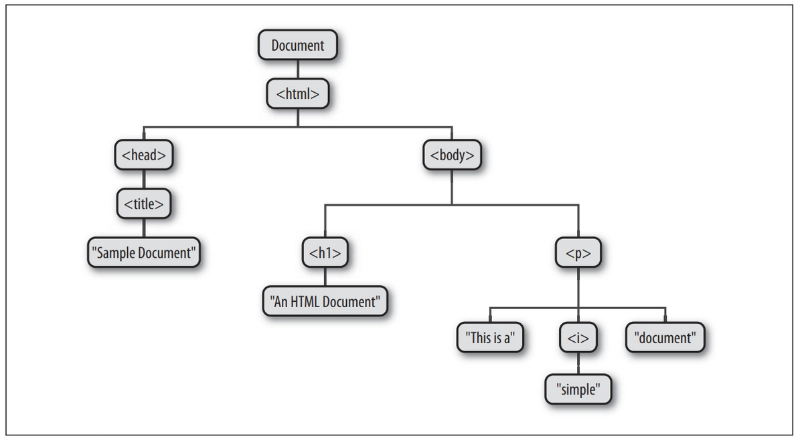
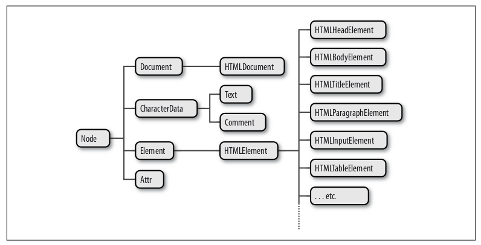

# Capítulo 15 - ESCREVENDO SCRIPT DE DOCUMENTOS

JavaScript do lado do cliente existe para transformar documentos HTML estáticos em aplicativos Web interativos. Fazer scripts do conteúdo de páginas Web é o principal objetivo de JavaScript.

Este capítulo começa explicando a arquitetura básica do DOM. Em seguida, passa a explicar:

- Como consultar ou selecionar elementos individuais de um documento.
- Como percorrer um documento como uma árvore de nós e como localizar os ascendentes, irmãos e descendentes de qualquer elemento do documento.
- Como consultar e configurar os atributos dos elementos do documento.
- Como consultar, configurar e modificar o conteúdo de um documento.
- Como modificar a estrutura de um documento, criando, inserindo e excluindo nós.
- Como trabalhar com formulários HTML.

## 15.1 - VISÃO GERAL DO DOM

Document Object Model, ou DOM, é a API fundamental para representar e manipular o conteúdo de documentos HTML e XML. A API não é especialmente complicada, mas existem vários detalhes de arquitetura que precisam ser entendidos. Primeiramente, você deve entender que os elementos aninhados de um documento HTML ou XML são representados na DOM como uma árvore de objetos. A representação em árvore de um documento HTML contém nós representando marcações ou elementos HTML, como body e p , e nós representando strings de texto. Um documento HTML também pode conter nós representando comentários HTML.

O Dom é representado da seguinte forma:

Se você ainda não conhece as estruturas em árvore da programação de computador, é útil saber que elas emprestam a terminologia das árvores genealógicas. O nó imediatamente acima de outro é o pai desse nó. Os nós um nível imediatamente abaixo de outro nó são os filhos desse nó. Os nós no mesmo nível e com o mesmo pai são irmãos. O conjunto de nós a qualquer número de níveis abaixo de outro nó são os descendentes desse nó. E o pai, avô e todos os outros nós acima de um nó são os ascendentes desse nó.Node e seus subtipos formam a hierarquia de tipos. Observe que há uma distinção formal entre os tipos genéricos Document e Element, e os tipos HTMLDocument e HTMLElement. O tipo Document representa um documento HTML ou XML e a classe Element representa um elemento desse documento. As subclasses HTMLDocument e HTMLElement são específicas de documentos e elementos HTML.

---

## 15.2 - SELECIONANDO ELEMENTOS DO DOCUMENTO

Para manipular elementos do documento, eles precisam de algum modo obter ou selecionar os objetos Element que se referem a esses elementos de documento. O DOM define várias maneiras de selecionar elementos.

### 15.2.1 - Selecionando elementos pela identificação

Qualquer elemento HTML pode ter um atributo id . O valor desse atributo deve ser único dentro do documento – dois elementos no mesmo documento não podem ter a mesma identificação. Você pode selecionar um elemento com base nessa identificação exclusiva com o método getElementById() do objeto Document.

### 15.2.2 - Selecionando elementos pelo nome

O atributo HTML name se destinava originalmente a atribuir nomes a elementos de formulário e o valor desse atributo é usado quando dados de formulário são enviados para um servidor. Assim como o atributo id , name atribui um nome a um elemento. Ao contrário de id , contudo, o valor de um atributo name não precisa ser único: vários elementos podem ter o mesmo nome e isso é comum no caso de botões de seleção e caixas de seleção em formulários. Além disso, ao contrário de id , o atributo name é válido somente em alguns elementos HTML, incluindo formulários, elementos de formulário, iframe e elementos img. getElementsByName() é definido pela classe HTMLDocument (e não pela classe Document) e, assim, só está disponível para documentos HTML e não para documentos XML. Ele retorna um objeto NodeList que se comporta como um array somente para leitura de objetos Element. No IE, getElementsByName() também retorna elementos que têm um atributo id com o valor especificado.

### 15.2.3 - Selecionando elementos pelo tipo

Todos os elementos HTML ou XML de um tipo (ou nome de marcação) especificado podem ser selecionados usando-se o método getElementsByTagName() do objeto Document. Assim como getElementsByName()getElementsByTagName() retorna um objeto NodeList. (Consulte o quadro desta seção para obter mais informações sobre a classe NodeList.) Os elementos do objeto NodeList retornado estão na ordem do documento; portanto, o primeiro elemento p de um documento pode ser selecionado apartir da posição de um array.

### 15.2.4 - Selecionando elementos por classe CSS

O atributo class de uma HTML é uma lista separada de zero ou mais identificadores por espaços. Ele descreve uma maneira de definir conjuntos de elementos relacionados do documento: todos os elementos que têm o mesmo identificador em seu atributo class fazem parte do mesmo conjunto. class é uma palavra reservada de JavaScript, de modo que JavaScript do lado do cliente utiliza a propriedade className para conter o valor do atributo HTML class . O atributo class normalmente é usado em conjunto com uma folha de estilos CSS para aplicar os mesmos estilos de apresentação em todos os membros de um conjunto. Assim como getElementsByTagName() , getElementsByClassName() pode ser chamado em documentos HTML e em elementos HTML, retornando um NodeList dinâmico, contendo todos os descendentes coincidentes do documento ou elemento. getElementsByClassName() recebe um único argumento de string, mas a string pode especificar vários identificadores separados por espaços. Somente os elementos que incluem todos os identificadores especificados em seus atributos class são coincidentes.

### 15.2.5 - Selecionando elementos por seletores CSS

As folhas de estilos CSS têm uma sintaxe muito poderosa, conhecida como seletores, para descrever elementos ou conjuntos de elementos dentro de um documento. Os seletores CSS permitem que elementos sejam selecionados de todas as maneiras descritas anteriormente: pela identificação, pelo nome, pelo nome de tag e pelo nome da classe. Junto com a padronização de seletores CSS3, outro padrão da W3C, conhecido como
“API de Seletores” define métodos JavaScript para obter os elementos que coincidem com determinado seletor. O segredo dessa API é o método querySelectorAll() de Document. Ele recebe um argumento de string contendo um seletor CSS e retorna um objeto NodeList representando todos os elementos do documento que correspondem ao seletor. Ao contrário dos métodos de seleção de elemento descritos anteriormente, o objeto NodeList retornado por querySelectorAll() não é dinâmico: ele contém os elementos que correspondiam ao seletor no momento em que o método foi chamado, mas não é atualizado quando o documento muda.

### 15.2.6 - document.all[]

Antes do DOM ser padronizado, o IE4 introduziu a coleção document.all[] que representava todos os elementos (mas não nós Text) do documento. document.all[] foi substituída por métodos padrão, como getElementById() e getElementsByTagName() , e agora está obsoleta, não devendo ser usada.

---

## 15.3 - ESTRUTURA DE DOCUMENTO E COMO PERCORRÊ-LOS

Após ter selecionado um Element de um Document, às vezes você precisa encontrar partes estruturalmente relacionadas (pai, irmãos, filhos) do documento. Um Document pode ser conceituado como uma árvore de objetos Node. O tipo Node define propriedades para percorrer essa árvore. Outra API permite percorrer
documentos como árvores de objetos Element.

### 15.3.1 - Documentos como árvore de Nodes

O objeto Document, seus objetos Element e os objetos Text que representam texto no documento, são todos objetos Node. Node define as seguintes propriedades importantes:

- parentNode: O objeto Node que é o pai desse nó, ou null para nós como o objeto Document, que não têm pai.
- childNodes: Um objeto semelhante a um array somente para leitura (um NodeList) que é uma representação dinâmica dos nós filhos de um Node.
- firstChild, lastChild: O primeiro e o último nós filhos de um nó, ou null se o nó não tem filhos.
- nextSibling, previousSibling: O nó irmão próximo e anterior de um nó. Dois nós com o mesmo pai são irmãos. Sua ordem
  reflete a ordem na qual aparecem no documento. Essas propriedades conectam nós em uma lista duplamente encadeada.
- nodeType: O tipo do nó. Os nós Document têm o valor 9. Os nós Element têm o valor 1. Os nós Text têm o valor 3. Os nós Comments são 8 e os nós DocumentFragment são 11.
- nodeValue: O conteúdo textual de um nó Text ou Comment.
- nodeName: O nome da marca de um Element, convertido em letras maiúsculas.

### 15.3.2 - Documentos como árvores de Elements

Quando estamos interessados principalmente nos objetos Element de um documento, em vez do texto dentro deles (e o espaço em branco entre eles), é útil usar uma API que nos permita tratar um documento como uma árvore de objetos Element, ignorando os nós Text e Comment que também fazem parte do documento. A primeira parte dessa API é a propriedade children de objetos Element. Assim como childNodes, isso é um NodeList. Ao contrário de childNodes, contudo, a lista de children contém apenas objetos Element. A segunda parte de uma API para percorrer documentos baseada em elemento são propriedades Element análogas às propriedades filho e irmão do objeto Node.

---

## 15.4 - ATRIBUTOS

Os elementos HTML consistem em um nome de tag e um conjunto de pares nome/valor conhecidos como atributos. O elemento `a` que define um hiperlink, por exemplo, utiliza o valor de seu atributo href como destino do link. Os valores de atributo dos elementos HTML estão disponíveis como propriedades dos objetos HTMLElement que representam esses elementos. O DOM também define outras APIs para obter e configurar os valores de atributos XML e atributos HTML não padronizados.

### 15.4.1 - Atributos HTML como propriedades de Element

Os objetos HTMLElement que representam os elementos de um documento HTML definem propriedades de leitura/gravação que espelham os atributos HTML dos elementos. HTMLElement define propriedades para os atributos HTTP universais, como id, title lang e dir, e propriedades de rotina de tratamento de evento, como onclick. Os subtipos específicos dos elementos definem atributos específicos para esses elementos.

### 15.4.2 - Obtendo e configurando atribuitos que não são HTML

Conforme descrito anteriormente, HTMLElement e seus subtipos definem propriedades que correspondem aos atributos padrão de elementos HTML. O tipo Element também define métodos getAttribute() e setAttribute() que podem ser usados para consultar e configurar atributos HTML não padronizados e para consultar e configurar atributos nos elementos de um documento XML. Element também define dois métodos relacionados, hasAttribute() e removeAttribute(), o primeiro dos quais verifica a presença de um atributo nomeado e o outro remove um atributo inteiramente. Esses métodos são especialmente úteis com atributos booleanos: esses são atributos (como o atributo disabled de elementos de formulário HTML) cuja presença ou ausência em um elemento importa, mas cujo valor não é relevante.

### 15.4.3 - Atributos de conjuntos de dados

HTML5 oferece uma solução. Em um documento HTML5, qualquer atributo cujo nome apareça em letras minúsculas e comece com o prefixo “data-” é considerado válido. Esses “atributos de conjunto de dados” não vão afetar a apresentação dos elementos nos quais aparecem e definem uma maneira padronizada de anexar mais dados sem comprometer a validade do documento. HTML5 também define uma propriedade dataset em objetos Element. Essa propriedade se refere a um objeto, o qual tem propriedades que correspondem aos atributos data- com o prefixo removido. Assim, dataset.x conteria o valor do atributo data-x . Os atributos hifenizados são mapeados em nomes de propriedade com maiúsculas no meio: o atributo data-jquery-test se torna a propriedade dataset.jqueryTest.

### 15.4.4 - Atributos como nós Attr

O tipo Node define uma propriedade attributes . Essa propriedade é null para todos os nós que não são objetos Element. Para objetos Element, attributes é um objeto semelhante a um array somente para leitura que representa todos os atributos do elemento. O objeto attributes é dinâmico como os NodeLists. Ele pode ser indexado numericamente, ou seja, é possível enumerar todos os atributos de um elemento.

---

## 15. 5 - CONTEÚDO DE ELEMENTO
