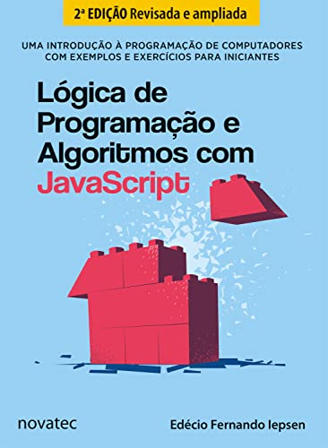

	
	<h1>Lógica de Programação e Algoritmos em JavaScript</h1>

|           Índice           | Descrição                             |
| :------------------------: | :------------------------------------ |
| [Capítulo 1](/capitulo01/) | Introdução                            |
| [Capítulo 2](/capitulo02/) | Integreação com HTML                  |
| [Capítulo 3](/capitulo03/) | Condicionais                          |
| [Capítulo 4](/capitulo04/) | Repetições                            |
| [Capítulo 5](/capitulo05/) | Vetores                               |
| [Capítulo 6](/capitulo06/) | Strings e datas                       |
| [Capítulo 7](/capitulo07/) | Funções e eventos                     |
| [Capítulo 8](/capitulo08/) | Percistência de dados                 |
| [Capítulo 9](/capitulo09/) | Inserir elementos HTML via JavaScript |
| [Capítulo 10](/capitulo10) | É muito bom programar... Programe!    |

